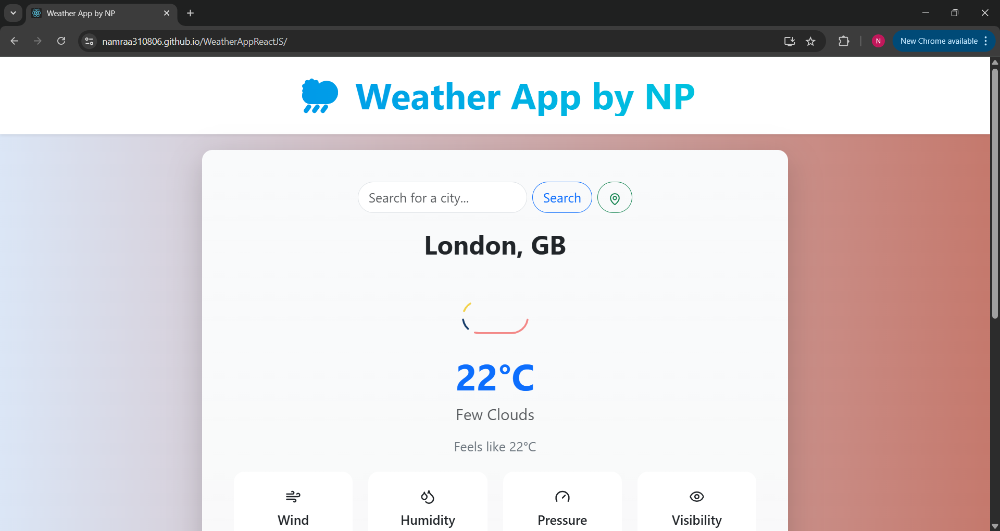
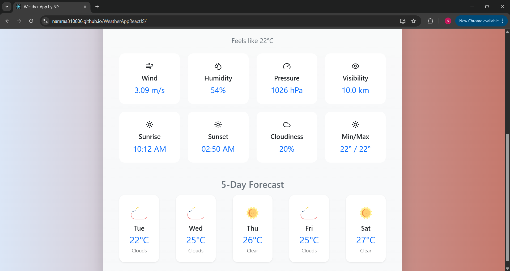
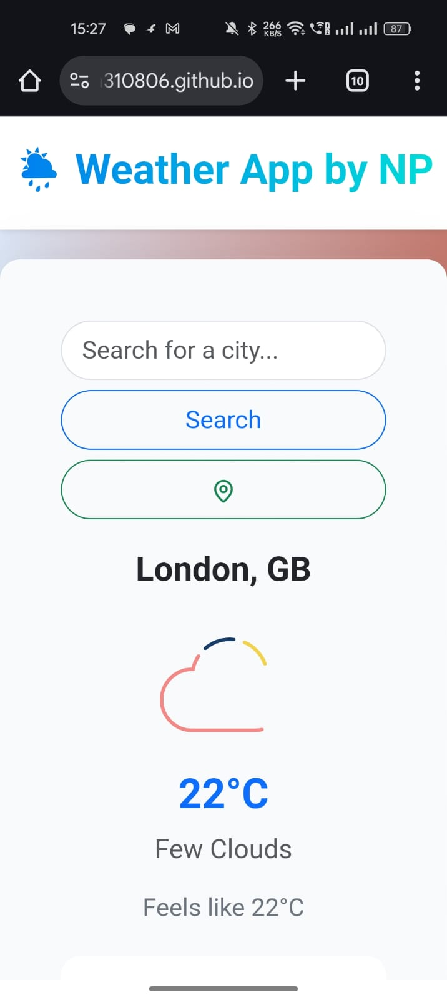

# 🌦️ Weather App by NP

A modern, responsive weather application built with React that provides real-time weather information and forecasts for any location worldwide.

## 🚀 Live Demo

Check out the live application: [Weather App Demo](https://namraa310806.github.io/WeatherAppReactJS/)

## 📸 Screenshots

<div align="center">
  
  <p><em>Main weather display with current conditions</em></p>
  
  
  <p><em>5-day weather forecast</em></p>
  
  
  <p><em>Responsive mobile view</em></p>
</div>

## ✨ Features

- 🔍 Search for any city worldwide
- 📍 Get weather for your current location
- 🌡️ Real-time temperature and weather conditions
- 📊 Detailed weather information including:
  - Temperature (current, feels like, min/max)
  - Wind speed
  - Humidity
  - Pressure
  - Visibility
  - Sunrise/Sunset times
  - Cloud coverage
- 📅 5-day weather forecast
- 🎨 Beautiful animations and modern UI
- 📱 Fully responsive design

## 🛠️ Technologies Used

- React.js
- OpenWeather API
- Lucide React Icons
- Lottie Animations
- Animate.css
- Bootstrap
- CSS3

## 🚀 Getting Started

1. Clone the repository:
```bash
git clone https://github.com/Namraa310806/WeatherAppReactJS.git
```

2. Install dependencies:
```bash
cd WeatherAppReactJS
npm install
```

3. Create a `.env` file in the root directory and add your API keys:
```
REACT_APP_OPENWEATHER_API_KEY=your_openweather_api_key
```

4. Start the development server:
```bash
npm start
```

## 🔑 API Keys Required

This project uses the OpenWeather API. You'll need to:
1. Sign up at [OpenWeather](https://openweathermap.org/api)
2. Get your API key
3. Add it to your `.env` file

## 🤝 Contributing

Contributions, issues, and feature requests are welcome! Feel free to check the [issues page](https://github.com/Namraa310806/WeatherAppReactJS/issues).

## 📝 License

This project is open source and available under the [MIT License](LICENSE).

## 👨‍💻 Author

**Namraa Patel**
- GitHub: [@Namraa310806](https://github.com/Namraa310806)

## 🙏 Acknowledgments

- OpenWeather for providing the weather data API
- All the amazing open-source libraries used in this project
